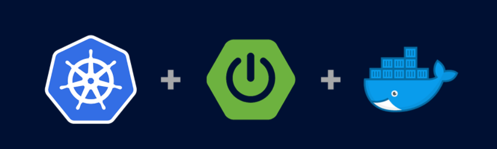

## [spring-boot-kubernetes-demo](#spring-boot-kubernetes-demo)
Run spring boot application on kubernetes cluster using imperative commands.

## [Prerequisite / Libraries used](#Prerequisite)
* Docker and kubernetes cluster
* kubectl
* Spring Boot
* Spring Configuration
* Spring REST Controller

## [Compilation command](#compilation-command)
```mvn clean package -DskipTests```

## [Imperative commands for kubernetes](#imperative-commands)
> Create a docker image
```docker build -t springboot-k8s:1.0 .```

# Create a deployment by using the below command

kubectl run springboot-k8s --image=springboot-k8s:1.0 --port 8080 --image-pull-policy=Never

# Create a service by using the below command

kubectl expose deployment springboot-k8s --type=NodePort

# You can scale the deployment by using the below command

kubectl scale --replicas=3 deployment/springboot-k8s

# Command to see a list of Pods

kubectl get pods

# Command to see a list of Deployments

kubectl get deployments

# Command to see a list of Services

kubectl get services

# Get details of your deployments

kubectl describe deployments

# Get details of your replicas

kubectl describe rs

# Verify
Please get the running node port from `kubectl get services'


GET -> `http://localhost:<nodePort>/hello` - This will return a simple msg 'Welcome to my first k8s controller'


# Libraries used
-  Spring Boot
-  Spring Configuration
-  Spring REST Controller
-  Minikube or Docker Desktop
-  Development Tools

# Compilation Command
`mvn clean install` - Plain maven clean and install
